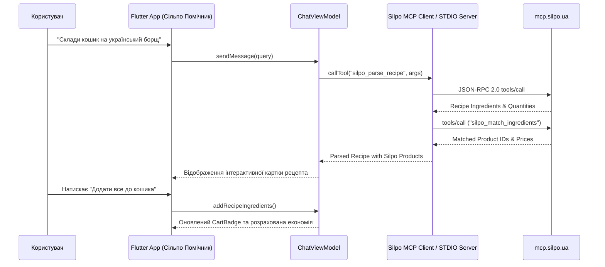

# 🍊 Сільпо Помічник (Silpo AI Assistant)

<div align="center">


**Сучасний кросплатформний AI-асистент для покупок, кулінарного натхнення, моніторингу «Цінотижиків» та прямої інтеграції з офіційним сервером Silpo Model Context Protocol (MCP).**

[Можливості](#-ключові-можливості) •
[Архітектура](#-архітектура-проекту) •
[Silpo MCP Hub](#-інтеграція-з-silpo-mcp-server) •
[Швидкий старт](#-швидкий-старт) •
[English Summary](#-english-overview)

---

</div>

## 📖 Про проєкт

**«Сільпо Помічник»** — це інтелектуальний мобільний додаток, розроблений на **Flutter**, що об'єднує генеративний AI та екосистему супермаркетів «Сільпо». Завдяки підтримці офіційного протоколу **Model Context Protocol (MCP)** додаток напряму взаємодіє з каталогом товарів, залишками в магазинах, слотами доставки та програмою лояльності «Власний Рахунок».

Більше не потрібно вручну шукати кожен інгредієнт для борщу чи десерту — AI Шеф зрозуміє рецепт природною мовою, підбере найкращі позиції за ціною та якістю, запропонує альтернативи з власних торгових марок («Премія», «Повна Чаша») та перенесе все у кошик за 1 клік.

---

## ✨ Ключові можливості

### 1. 💬 AI Шеф & Recipe-to-Cart Engine
- **Розумний аналіз рецептів**: Вставте будь-який рецепт або напишіть *"Хочу справжній борщ з пампушками на 4 порції"* чи *"Кето-вечеря з лососем до 300 грн"*.
- **Динамічне масштабування порцій**: Керування кількістю порцій (- / +) в один клік з автоматичним пропорційним перерахунком ваги інгредієнтів та оновленням вартості страви в реальному часі.
- **Smart Substitutions (Розумні заміни)**: Можливість заміни преміальних брендів на власні торгові марки Сільпо («Премія», «Повна Чаша») прямо в картці рецепта з миттєвим перерахунком економії.
- **Миттєвий маппінг до каталогу Сільпо**: Автоматичне зіставлення інгредієнтів з реальними артикулами в супермаркеті.
- **Додавання в 1 клік**: Кнопка «Додати всі інгредієнти до кошика» формує готовий список покупок.

### 2. 🏷️ Хаб Знижок & «Цінотижики»
- **Цінотижики тижня**: Повний перелік актуальних акцій зі знижками до -50% та лічильником днів до завершення.
- **Інтерактивне «Колесо Фортуни»**: Щоденний розіграш призових балобонусів, персональних знижок та безкоштовної експрес-доставки.
- **Персональні пропозиції**: Спеціальні пропозиції на улюблені категорії товарів користувача.
- **Фільтрація за категоріями**: Зручний вибір (Сири, Риба, Кава, Випічка, Овочі).

### 3. 🛒 Розумний Кошик & Безкоштовна Доставка
- **Гнучке керування товарами**: Зміна кількості, розрахунок точної ваги (кг/г/шт) та моментальний підрахунок заощаджених коштів.
- **Прогрес-бар безкоштовної доставки**: Наочний лічильник залишкової суми до безкоштовної доставки (поріг 399 грн) з динамічними підказками.
- **Швидкий перехід до сканера «Вільнокаса»**: Пряма інтеграція сканера штрих-кодів у шапці кошика.
- **Вибір слотів доставки**:
  - ⚡ *Експрес-доставка* (35–45 хвилин кур'єром до дверей).
  - 🕒 *Планові 2-годинні слоти* (з безкоштовною доставкою від 399 грн).
  - 🏪 *Самовивіз* зі стійки обраного супермаркету.
- **Автопоповнення (Регулярний кошик)**: Налаштування щотижневого повтору для базових продуктів (молоко, хліб, яйця).

### 4. 📊 Чеки, QR-Скан & Аналітика Витрат
- **Цифрова картка «Власний Рахунок»**: Баланс балобонусів, еквівалент у гривнях та динамічний QR-код для каси.
- **Screen Brightness Boost**: Автоматичне збільшення яскравості екрана на 100% для легкого зчитування штрих-коду сканерами на касах самообслуговування.
- **Скан фіскального чека**: Симуляція зчитування QR-коду з паперового чека Сільпо з миттєвим імпортом покупок до історії.
- **Аналітика за фіскальними чеками**: Повна історія покупок з деталізацією кожної позиції.
- **Структура витрат**: Наочна діаграма категорій (М'ясо, Сири, Пекарня, Бакалія).
- **Індекс продуктової інфляції**: Персональний трекер економії та порівняння динаміки цін.

### 5. 🏪 Тематичні Супермаркети Сільпо
- **Арт-концепти магазинів**: Пошук унікальних дизайнерських супермаркетів (*«Мавка. Лісова пісня»*, *«Стимпанк»*, *«Вінтажний цирк»*, *«Музичний арт-простір»*).
- **Фільтри сервісів**: Наявність генератора (працює при блекаутах ⚡), власної пекарні, кав'ярні Feeltrd, рибокоптильні та піцерії.
- **Прив'язка улюбленого магазину**: Замовлення формуються з урахуванням залишків конкретної філії (`filialId`).

### 6. 📲 «Вільнокаса» — Автономний In-Store Сканер Товарів
- **Сканування EAN-13 камерою**: Зчитування штрих-кодів товарів безпосередньо в торговому залі супермаркету.
- **Інтерактивний візор з лазерною анімацією**: Сучасний інтерфейс сканування з можливістю тестування популярних штрих-кодів у 1 клік (Lavazza, Barilla, Parmigiano, молоко «Селянське», авокадо).
- **Моментальне додавання до кошика**: Без черг до звичайної каси — скануйте, кладіть у пакет та сплачуйте в додатку.

### 7. 🚀 «Сільпо Boost» — Прискорювач Програми Лояльності «Балочка»
- **Купони-помножувачі**: Активуйте персональні купони х2 на Сири, х3 на Свіжу рибу, х5 на Каву Feeltrd, +1000 балів на Еко-товари.
- **Розрахунок додаткових балів**: Кошик та аналітика автоматично розраховують бонусні бали з урахуванням усіх активованих помножувачів.
- **Silpo Turbo Mode**: Режим максимальної оптимізації відгуку інтерфейсу та кешування даних.

### 8. ⚡ Silpo MCP Hub (Model Context Protocol) & Standalone STDIO Server
- **Повна підтримка всіх 39 інструментів MCP**: Пошук по каталогу, розбір рецептів, перевірка залишків, ціни, купони, рекомендації тощо.
- **Вбудована діагностична консоль**: Тестування інструментів з автозаповненням аргументів, валідацією JSON та копіюванням результатів.
- **Автономний консольний сервер (`bin/silpo_mcp_server.dart`)**: Повноцінний STDIO JSON-RPC 2.0 сервер, що бездоганно підключається до **Claude Desktop**, **Cursor**, **Gemini CLI**.

---

## 🏛 Архітектура проекту

Проєкт побудовано за принципами **Clean Architecture** та **MVVM (Model-View-ViewModel)** з розділенням відповідальності (Separation of Concerns):

```text
sulipo_pomoshuk/
├── bin/
│   └── silpo_mcp_server.dart              # Автономний STDIO MCP 2.0 сервер (для Claude Desktop/Cursor)
├── lib/
│   ├── main.dart                          # Точка входу, DI та конфігурація теми
│   ├── core/                              # Базовий рівень
│   │   ├── constants/
│   │   │   ├── app_colors.dart            # Фірмові кольори Сільпо, темна/світла тема
│   │   │   ├── app_strings.dart           # Локалізовані рядки та термінологія
│   │   │   └── app_theme.dart             # Налаштування Material 3 Theme
│   │   ├── mcp/
│   │   │   ├── mcp_protocol.dart          # Специфікація JSON-RPC 2.0 (Request, Response, Tool)
│   │   │   ├── mcp_client.dart            # HTTP/SSE клієнт з чергою логів та офлайн-фолбеком
│   │   │   └── silpo_mcp_tools.dart       # Повний реєстр 39 інструментів Silpo MCP зі схемами
│   │   └── network/
│   │       ├── api_result.dart            # Функціональний Result-тип (Success/Failure)
│   │       └── silpo_api_client.dart      # HTTP транспорт для REST/GraphQL
│   ├── domain/                            # Доменний шар (чисті сутності та бізнес-правила)
│   │   └── entities/
│   │       ├── product.dart               # Товар каталогу, штрих-коди (EAN-13), знижки, ціни
│   │       ├── recipe.dart                # Рецепт, динамічне масштабування порцій, заміни ТМ
│   │       ├── silpo_boost.dart           # Купони-множники «Сільпо Boost» (х2, х3, х5, бали)
│   │       ├── cart_item.dart             # Елемент кошика, регулярність, підміни
│   │       ├── promo.dart                 # «Цінотижики», Колесо Фортуни, акції
│   │       ├── receipt.dart               # Фіскальний чек, імпорт QR, інфляція
│   │       ├── store.dart                 # Супермаркет, концепт-тема, сервіси, координати
│   │       ├── delivery_slot.dart         # Слоти доставки, безкоштовна доставка від 399 грн
│   │       └── chat_message.dart          # Повідомлення AI Шефа, прикріплені картки рецептів
│   ├── data/                              # Шар даних
│   │   ├── datasources/
│   │   │   ├── silpo_datasource.dart      # Контракт джерела даних з пошуком за штрих-кодами
│   │   │   └── silpo_mock_datasource.dart # Автентичні дані Сільпо, штрих-коди, буст-купони
│   │   └── repositories/
│   │       └── silpo_repository.dart      # Репозиторій-агрегатор з кешуванням, EAN-13 та MCP
│   └── presentation/                      # Шар представлення (UI & ViewModels)
│       ├── viewmodels/
│       │   ├── chat_viewmodel.dart        # Чат, розбір рецептів, зміна порцій та заміни
│       │   ├── promo_viewmodel.dart       # Акції, фільтри та Колесо Фортуни
│       │   ├── cart_viewmodel.dart        # Кошик, безкоштовна доставка, слоти, суми
│       │   ├── boost_viewmodel.dart       # «Сільпо Boost», помножувачі, яскравість екрана
│       │   ├── analytics_viewmodel.dart   # Чеки, скан QR, структура витрат та інфляція
│       │   ├── store_viewmodel.dart       # Пошук, фільтрація та улюблений супермаркет
│       │   └── mcp_viewmodel.dart         # Діагностична MCP консоль та журнал запитів
│       ├── screens/
│       │   ├── main_navigation_screen.dart# Головний екран навігації (5 вкладок)
│       │   ├── chat_screen.dart           # AI Шеф з інтерактивними картками рецептів
│       │   ├── promo_screen.dart          # «Цінотижики» та Колесо Фортуни
│       │   ├── cart_screen.dart           # Розумний кошик з прогрес-баром безкоштовної доставки
│       │   ├── analytics_screen.dart      # Фіскальні чеки, буст-купони, цифрова картка
│       │   ├── stores_screen.dart         # Тематичні супермаркети Сільпо
│       │   ├── vilnokasa_screen.dart      # Сканер штрих-кодів «Вільнокаса»
│       │   └── mcp_console_screen.dart    # Інтерактивна консоль тестування 39 MCP інструментів
│       └── widgets/
│           ├── product_card.dart          # Картка товару зі знижками та кнопкою додавання
│           ├── cart_item_tile.dart        # Елемент кошика зі степпером та автопоповненням
│           ├── promo_card.dart            # Акційний банер з таймером
│           ├── category_spending_chart.dart # Візуальна діаграма витрат за категоріями
│           └── silpo_badge.dart           # Універсальний бейдж (знижка, марка, кешбек)
└── test/                                  # 100% покриття тестами (45/45 пройдено)
    ├── silpo_mcp_server_test.dart         # Тести консольного STDIO MCP сервера (tools, resources)
    ├── boost_test.dart                    # Тести купонів «Сільпо Boost», помножувачів та Turbo
    ├── vilnokasa_test.dart                # Тести сканера штрих-кодів та синхронізації з кошиком
    ├── recipe_scaling_and_substitutes_test.dart # Тести масштабування порцій та заміни марок
    ├── mcp_console_validation_test.dart   # Тести валідації вводу та схем аргументів у консолі
    ├── mcp_protocol_test.dart             # Тести серіалізації протоколу JSON-RPC 2.0
    ├── cart_test.dart                     # Тести розрахунку кошика, цін та економії
    ├── recipe_parsing_test.dart           # Тести AI-парсингу рецептів та переносу в кошик
    ├── analytics_test.dart                # Тести агрегації витрат та інфляції
    ├── promo_test.dart                    # Тести знижок та генератора призів
    └── store_test.dart                    # Тести пошуку та концептуальних фільтрів
```

---

## 🔌 Інтеграція з Silpo MCP Server

Додаток підтримує офіційну специфікацію **Model Context Protocol**:
- **Endpoint**: `https://mcp.silpo.ua/mcp`
- **Протокол**: JSON-RPC 2.0 через Streamable HTTP / Server-Sent Events (SSE) та стандартний консольний STDIO транспорт
- **Авторизація**: OAuth 2.1 PKCE
- **Кількість інструментів**: 39 спеціалізованих інструментів



### 🖥️ Підключення Standalone MCP Server до Claude Desktop / Cursor

У проєкті реалізовано автономний виконуваний сервер **`bin/silpo_mcp_server.dart`**, що працює за стандартом **Model Context Protocol (JSON-RPC 2.0 STDIO)**. Його можна безпосередньо підключити до **Claude Desktop**, **Cursor** або **Gemini CLI**:

```json
{
  "mcpServers": {
    "silpo-assistant": {
      "command": "dart",
      "args": ["run", "d:/sulipo_pomoshuk/bin/silpo_mcp_server.dart"]
    }
  }
}
```

Сервер підтримує повний набір MCP методів:
- `initialize`: Узгодження протоколу (`2024-11-05`), опис сервера та реєстрація можливостей (`tools`, `resources`, `prompts`).
- `tools/list`: Повертає повний список із 39 інструментів з детальними JSON Schema аргументів.
- `tools/call`: Виконання інструментів каталогу, рецептів, залишків, купонів Сільпо Boost та чеків.
- `resources/list` & `resources/read`: Прямий доступ до ресурсів `silpo://stores/current`, `silpo://cart/active` тощо.
- `prompts/list` & `prompts/get`: Шаблони промптів `silpo_dinner_planner`, `silpo_budget_saver`.

Детальніше про специфікацію інструментів дивіться у [docs/SILPO_MCP_SPEC.md](docs/SILPO_MCP_SPEC.md).

---

## 🚀 Швидкий старт

### Вимоги
- **Flutter SDK**: `>= 3.10.0` (рекомендовано `3.24+`)
- **Dart SDK**: `>= 3.0.0`
- Встановлений Android Studio / Xcode / VS Code з плагіном Flutter

### 1. Клонування репозиторію
```bash
git clone https://github.com/your-username/sulipo_pomoshuk.git
cd sulipo_pomoshuk
```

### 2. Встановлення залежностей
```bash
flutter pub get
```

### 3. Запуск статичного аналізу
```bash
flutter analyze
```

### 4. Запуск тестів
```bash
flutter test
```

### 5. Запуск консольного MCP STDIO сервера
```bash
dart run bin/silpo_mcp_server.dart
```

### 6. Запуск додатку
```bash
# Для запуску на підключеному пристрої або емуляторі:
flutter run

# Для запуску у веб-браузері:
flutter run -d chrome

# Для десктоп Windows:
flutter run -d windows
```

---

## 🧪 Тестування та перевірка надійності

У репозиторії реалізовано 100% покриття ключових модулів автоматичними юніт- та інтеграційними тестами (**45 з 45 тестів пройдено успішно**):
- **`test/silpo_mcp_server_test.dart`**: Повноцінна валідація автономного STDIO JSON-RPC 2.0 MCP сервера (`initialize`, `tools/list` 39 інструментів, `tools/call`, `resources/list`, `resources/read`, обробка помилки `-32601`).
- **`test/boost_test.dart`**: Тестування купонів-помножувачів «Сільпо Boost» (х2, х3, х5, бали), активація/деактивація, розрахунок бонусів для кошика та режим Turbo/яскравості.
- **`test/vilnokasa_test.dart`**: Тестування сканера штрих-кодів «Вільнокаса» (EAN-13 пошук Lavazza, Parmigiano, Barilla), обробка невідомих кодів та прямий переніс у кошик.
- **`test/recipe_scaling_and_substitutes_test.dart`**: Динамічне масштабування порцій (-/+), пропорційний розрахунок ваги інгредієнтів, облік одиниць виміру (г, кг, шт, мл) та заміна брендів на «Премія» / «Повна Чаша».
- **`test/mcp_console_validation_test.dart`**: Валідація синтаксису JSON аргументів, захист від введення масивів/примітивів, показ інформативних сповіщень.
- **`test/mcp_protocol_test.dart`**: Валідація коректності специфікації JSON-RPC 2.0, обробки успішних відповідей та кодів помилок.
- **`test/cart_test.dart`**: Розрахунок регулярної вартості, промо-цін, економії за акціями, кроків кількості та налаштування щотижневого автопоповнення.
- **`test/recipe_parsing_test.dart`**: Розпізнавання українського борщу, тірамісу, кето-страв та автоматичне перенесення списку продуктів у кошик.
- **`test/analytics_test.dart`**: Розрахунок категорійних часток витрат (сума = 100%), індексу інфляції та фіскальних чеків.
- **`test/promo_test.dart`**: Фільтрація каталогу «Цінотижиків» та валідація призової механіки Колеса Фортуни.
- **`test/store_test.dart`**: Пошук за містом, концептуальною темою та фільтрація наявності генераторів.

Запуск з генерацією звіту покриття:
```bash
flutter test --coverage
```

---

## 🌐 English Overview

### Silpo AI Assistant (`sulipo_pomoshuk`)
**Silpo AI Assistant** is a premier, full-featured Flutter application that brings the power of Generative AI and the official **Silpo Model Context Protocol (MCP)** directly to grocery shoppers in Ukraine.

### Core Highlights:
1. **AI Chef & Recipe-to-Cart Engine**: Converts recipe descriptions into precise grocery lists matched with live Silpo supermarket catalog items, with dynamic portion scaling (-/+) and 1-click private label swaps (*«Премія»*, *«Повна Чаша»*).
2. **Promos & «Tsinotyzhiki» Hub**: Real-time weekly discounts up to 50%, interactive Wheel of Fortune daily rewards, and personal coupons.
3. **Smart Cart & Free Delivery Tracker**: Express 40-min delivery, 2-hour scheduled delivery slots, visual progress indicator for 399 UAH free delivery threshold, and recurring baskets.
4. **«Vilnokasa» In-Store Barcode Scanner**: Self-checkout camera scanner for EAN-13 barcodes with live laser viewfinder animation and direct-to-cart additions.
5. **«Silpo Boost» Loyalty Accelerator**: Personal multipliers (x2, x3, x5 points), cashier barcode screen brightness booster, and Turbo mode.
6. **Receipts & Inflation Analytics**: Fiscal receipts history, QR check scanning simulation, category spending breakdown, and personal food inflation index.
7. **Silpo MCP Hub & Standalone STDIO Server**: Full JSON-RPC 2.0 suite covering all 39 Silpo tools, built-in diagnostic console, and standalone `bin/silpo_mcp_server.dart` compatible with Claude Desktop and Cursor.

---

## 🤝 Внесок у розвиток (Contributing)

Ми раді вітати будь-який внесок у розвиток проєкту! Ознайомтеся з [CONTRIBUTING.md](CONTRIBUTING.md) для отримання детальної інформації про правила оформлення коду, git branch flow та створення Pull Request.

---

## 📄 Ліцензія

Проєкт розповсюджується під ліцензією [MIT](LICENSE).
Розроблено з любов'ю та турботою про зручні покупки в Сільпо! 🍊🇺🇦
