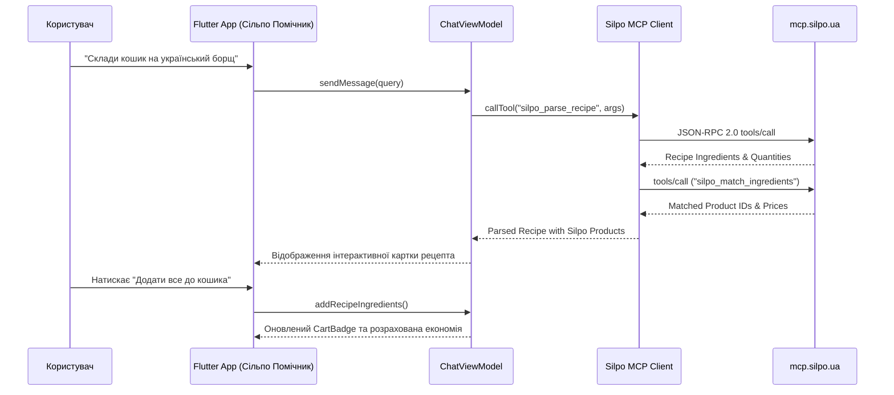

# 🍊 Сільпо Помічник (Silpo AI Assistant)

<div align="center">


**Сучасний кросплатформний AI-асистент для покупок, кулінарного натхнення, моніторингу «Цінотижиків» та прямої інтеграції з офіційним сервером Silpo Model Context Protocol (MCP).**

[Можливості](#-ключові-можливості) •
[Архітектура](#-архітектура-проекту) •
[Silpo MCP Hub](#-інтеграція-з-silpo-mcp-server) •
[Швидкий старт](#-швидкий-старт) •
[English Summary](#-english-overview)

---

</div>

## 📖 Про проєкт

**«Сільпо Помічник»** — це інтелектуальний мобільний додаток, розроблений на **Flutter**, що об'єднує генеративний AI та екосистему супермаркетів «Сільпо». Завдяки підтримці офіційного протоколу **Model Context Protocol (MCP)** додаток напряму взаємодіє з каталогом товарів, залишками в магазинах, слотами доставки та програмою лояльності «Власний Рахунок».

Більше не потрібно вручну шукати кожен інгредієнт для борщу чи десерту — AI Шеф зрозуміє рецепт природною мовою, підбере найкращі позиції за ціною та якістю, запропонує альтернативи з власних торгових марок («Премія», «Повна Чаша») та перенесе все у кошик за 1 клік.

---

## ✨ Ключові можливості

### 1. 💬 AI Шеф & Recipe-to-Cart Engine
- **Розумний аналіз рецептів**: Вставте будь-який рецепт або напишіть *"Хочу справжній борщ з пампушками на 4 порції"* чи *"Кето-вечеря з лососем до 300 грн"*.
- **Миттєвий маппінг до каталогу Сільпо**: Автоматичне зіставлення інгредієнтів з реальними артикулами в супермаркеті.
- **Smart Substitutions (Розумні заміни)**: Рекомендації дешевших аналогів та власних марок («Премія», «Повна Чаша») для економії бюджету.
- **Додавання в 1 клік**: Кнопка «Додати всі інгредієнти до кошика» формує готовий список покупок.

### 2. 🏷️ Хаб Знижок & «Цінотижики»
- **Цінотижики тижня**: Повний перелік актуальних акцій зі знижками до -50% та лічильником днів до завершення.
- **Інтерактивне «Колесо Фортуни»**: Щоденний розіграш призових балобонусів, персональних знижок та безкоштовної експрес-доставки.
- **Персональні пропозиції**: Спеціальні пропозиції на улюблені категорії товарів користувача.
- **Фільтрація за категоріями**: Зручний вибір (Сири, Риба, Кава, Випічка, Овочі).

### 3. 🛒 Розумний Кошик & Автопоповнення
- **Гнучке керування товарами**: Зміна кількості, розрахунок точної ваги (кг/г/шт) та моментальний підрахунок заощаджених коштів.
- **Вибір слотів доставки**:
  - ⚡ *Експрес-доставка* (35–45 хвилин кур'єром до дверей).
  - 🕒 *Планові 2-годинні слоти* (з безкоштовною доставкою від 399 грн).
  - 🏪 *Самовивіз* зі стійки обраного супермаркету.
- **Автопоповнення (Регулярний кошик)**: Налаштування щотижневого повтору для базових продуктів (молоко, хліб, яйця).

### 4. 📊 Чеки & Аналітика Витрат
- **Цифрова картка «Власний Рахунок»**: Баланс балобонусів, еквівалент у гривнях та динамічний QR-код для каси.
- **Аналітика за фіскальними чеками**: Повна історія покупок з деталізацією кожної позиції.
- **Структура витрат**: Наочна діаграма категорій (М'ясо, Сири, Пекарня, Бакалія).
- **Індекс продуктової інфляції**: Персональний трекер економії та порівняння динаміки цін.

### 5. 🏪 Тематичні Супермаркети Сільпо
- **Арт-концепти магазинів**: Пошук унікальних дизайнерських супермаркетів (*«Мавка. Лісова пісня»*, *«Стимпанк»*, *«Вінтажний цирк»*, *«Музичний арт-простір»*).
- **Фільтри сервісів**: Наявність генератора (працює при блекаутах ⚡), власної пекарні, кав'ярні Feeltrd, рибокоптильні та піцерії.
- **Прив'язка улюбленого магазину**: Замовлення формуються з урахуванням залишків конкретної філії (`filialId`).

### 6. ⚡ Silpo MCP Hub (Model Context Protocol)
- **Інтерактивна діагностична консоль**: Тестування будь-якого з **39 інструментів MCP** у реальному часі.
- **JSON-RPC 2.0 Log Console**: Детальний перегляд відправлених запитів та отриманих відповідей.
- **Автономний розумний режим (Smart Local Engine)**: Безшовна робота як з живим сервером `https://mcp.silpo.ua/mcp`, так і в офлайн-середовищі для розробників.

---

## 🏛 Архітектура проекту

Проєкт побудовано за принципами **Clean Architecture** та **MVVM (Model-View-ViewModel)** з розділенням відповідальності (Separation of Concerns):

```text
sulipo_pomoshuk/
├── lib/
│   ├── main.dart                          # Точка входу, DI та конфігурація теми
│   ├── core/                              # Базовий рівень
│   │   ├── constants/
│   │   │   ├── app_colors.dart            # Фірмові кольори Сільпо, темна/світла тема
│   │   │   ├── app_strings.dart           # Локалізовані рядки та термінологія
│   │   │   └── app_theme.dart             # Налаштування Material 3 Theme
│   │   ├── mcp/
│   │   │   ├── mcp_protocol.dart          # Специфікація JSON-RPC 2.0 (Request, Response, Tool)
│   │   │   ├── mcp_client.dart            # HTTP/SSE клієнт з чергою логів та офлайн-фолбеком
│   │   │   └── silpo_mcp_tools.dart       # Словник та схеми 39 інструментів Silpo MCP
│   │   └── network/
│   │       ├── api_result.dart            # Функціональний Result-тип (Success/Failure)
│   │       └── silpo_api_client.dart      # HTTP транспорт для REST/GraphQL
│   ├── domain/                            # Доменний шар (чисті сутності та бізнес-правила)
│   │   └── entities/
│   │       ├── product.dart               # Товар каталогу, знижки, ціни, артикули
│   │       ├── recipe.dart                # Рецепт, інгредієнти, калькуляція вартості
│   │       ├── cart_item.dart             # Елемент кошика, регулярність, підміни
│   │       ├── promo.dart                 # «Цінотижики», Колесо Фортуни, акції
│   │       ├── receipt.dart               # Фіскальний чек, аналітика категорій, інфляція
│   │       ├── store.dart                 # Супермаркет, концепт-тема, сервіси, координати
│   │       ├── delivery_slot.dart         # Слоти експрес та планової доставки
│   │       └── chat_message.dart          # Повідомлення AI Шефа, прикріплені картки
│   ├── data/                              # Шар даних
│   │   ├── datasources/
│   │   │   ├── silpo_datasource.dart      # Контракт джерела даних
│   │   │   └── silpo_mock_datasource.dart # Реалістичні автентичні дані Сільпо
│   │   └── repositories/
│   │       └── silpo_repository.dart      # Репозиторій-агрегатор з кешуванням та MCP
│   └── presentation/                      # Шар представлення (UI & ViewModels)
│       ├── viewmodels/
│       │   ├── chat_viewmodel.dart        # Логіка чату, розбору рецептів та виклику MCP
│       │   ├── promo_viewmodel.dart       # Логіка акцій, фільтрів та Колеса Фортуни
│       │   ├── cart_viewmodel.dart        # Логіка кошика, сум, економії та слотів
│       │   ├── analytics_viewmodel.dart   # Розрахунок інфляції, чеків та категорій
│       │   ├── store_viewmodel.dart       # Пошук, фільтрація та вибір супермаркету
│       │   └── mcp_viewmodel.dart         # Стан MCP консолі та журналювання
│       ├── screens/
│       │   ├── main_navigation_screen.dart# Головний екран з 5 табами
│       │   ├── chat_screen.dart           # Екран AI Шефа
│       │   ├── promo_screen.dart          # Екран «Цінотижиків» та Колеса Фортуни
│       │   ├── cart_screen.dart           # Екран кошика та оформлення
│       │   ├── analytics_screen.dart      # Екран фіскальних чеків та аналітики
│       │   ├── stores_screen.dart         # Екран вибору супермаркетів
│       │   └── mcp_console_screen.dart    # Діагностична MCP консоль
│       └── widgets/
│           ├── product_card.dart          # Картка товару зі знижками та кнопкою додавання
│           ├── cart_item_tile.dart        # Елемент кошика зі степпером та автопоповненням
│           ├── promo_card.dart            # Акційний банер з таймером
│           ├── category_spending_chart.dart # Візуальна діаграма витрат за категоріями
│           └── silpo_badge.dart           # Універсальний бейдж (знижка, марка, кешбек)
└── test/                                  # Покриття модульними та інтеграційними тестами
    ├── mcp_protocol_test.dart             # Тести серіалізації протоколу JSON-RPC 2.0
    ├── cart_test.dart                     # Тести розрахунку кошика, цін та економії
    ├── recipe_parsing_test.dart           # Тести AI-парсингу рецептів та переносу в кошик
    ├── analytics_test.dart                # Тести агрегації витрат та інфляції
    ├── promo_test.dart                    # Тести знижок та генератора призів
    └── store_test.dart                    # Тести пошуку та концептуальних фільтрів
```

---

## 🔌 Інтеграція з Silpo MCP Server

Додаток підтримує офіційну специфікацію **Model Context Protocol**:
- **Endpoint**: `https://mcp.silpo.ua/mcp`
- **Протокол**: JSON-RPC 2.0 через Streamable HTTP / Server-Sent Events (SSE)
- **Авторизація**: OAuth 2.1 PKCE
- **Кількість інструментів**: 39 спеціалізованих інструментів



Детальніше про специфікацію інструментів дивіться у [docs/SILPO_MCP_SPEC.md](docs/SILPO_MCP_SPEC.md).

---

## 🚀 Швидкий старт

### Вимоги
- **Flutter SDK**: `>= 3.10.0` (рекомендовано `3.24+`)
- **Dart SDK**: `>= 3.0.0`
- Встановлений Android Studio / Xcode / VS Code з плагіном Flutter

### 1. Клонування репозиторію
```bash
git clone https://github.com/your-username/sulipo_pomoshuk.git
cd sulipo_pomoshuk
```

### 2. Встановлення залежностей
```bash
flutter pub get
```

### 3. Запуск статичного аналізу
```bash
flutter analyze
```

### 4. Запуск тестів
```bash
flutter test
```

### 5. Запуск додатку
```bash
# Для запуску на підключеному пристрої або емуляторі:
flutter run

# Для запуску у веб-браузері:
flutter run -d chrome

# Для десктоп Windows:
flutter run -d windows
```

---

## 🧪 Тестування та перевірка надійності

У репозиторії реалізовано комплексний набір юніт-тестів для всіх ключових модулів:
- **`test/mcp_protocol_test.dart`**: Валідація коректності специфікації JSON-RPC 2.0, обробки успішних відповідей та кодів помилок.
- **`test/cart_test.dart`**: Розрахунок регулярної вартості, промо-цін, економії за акціями, кроків кількості та налаштування щотижневого автопоповнення.
- **`test/recipe_parsing_test.dart`**: Розпізнавання українського борщу, тірамісу, кето-страв та автоматичне перенесення списку продуктів у кошик.
- **`test/analytics_test.dart`**: Розрахунок категорійних часток витрат (сума = 100%), індексу інфляції та фіскальних чеків.
- **`test/promo_test.dart`**: Фільтрація каталогу «Цінотижиків» та валідація призової механіки Колеса Фортуни.
- **`test/store_test.dart`**: Пошук за містом, концептуальною темою та фільтрація наявності генераторів.

Запуск з генерацією звіту покриття:
```bash
flutter test --coverage
```

---

## 🌐 English Overview

### Silpo AI Assistant (`sulipo_pomoshuk`)
**Silpo AI Assistant** is a premier, full-featured Flutter application that brings the power of Generative AI and the official **Silpo Model Context Protocol (MCP)** directly to grocery shoppers in Ukraine.

### Core Highlights:
1. **AI Chef & Recipe-to-Cart Engine**: Converts recipe descriptions into precise grocery lists matched with live Silpo supermarket catalog items, highlighting private labels (*«Премія»*, *«Повна Чаша»*) for cost efficiency.
2. **Promos & «Tsinotyzhiki» Hub**: Real-time weekly discounts up to 50%, interactive Wheel of Fortune daily rewards, and personal coupons.
3. **Smart Cart & Scheduled Replenishment**: Express 40-min delivery, 2-hour scheduled delivery slots, and recurring baskets.
4. **Receipts & Inflation Analytics**: Fiscal receipts history, category spending breakdown, and personal food inflation index.
5. **Silpo MCP Server Console**: Built-in developer hub connecting to `https://mcp.silpo.ua/mcp` with full JSON-RPC 2.0 tool execution and streaming diagnostics.

---

## 🤝 Внесок у розвиток (Contributing)

Ми раді вітати будь-який внесок у розвиток проєкту! Ознайомтеся з [CONTRIBUTING.md](CONTRIBUTING.md) для отримання детальної інформації про правила оформлення коду, git branch flow та створення Pull Request.

---

## 📄 Ліцензія

Проєкт розповсюджується під ліцензією [MIT](LICENSE).
Розроблено з любов'ю та турботою про зручні покупки в Сільпо! 🍊🇺🇦
